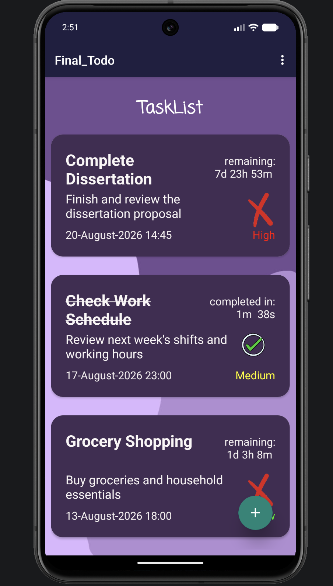
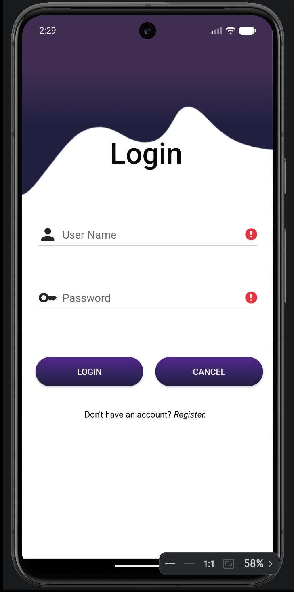
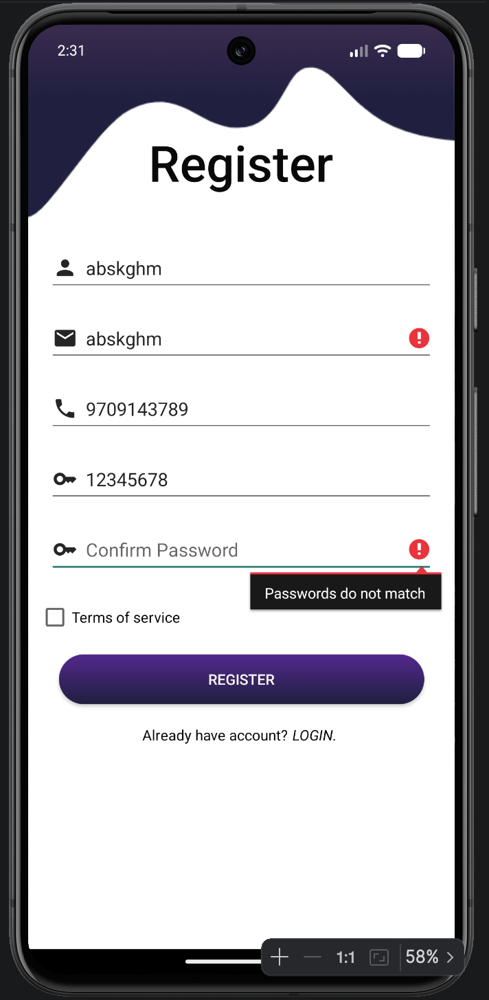
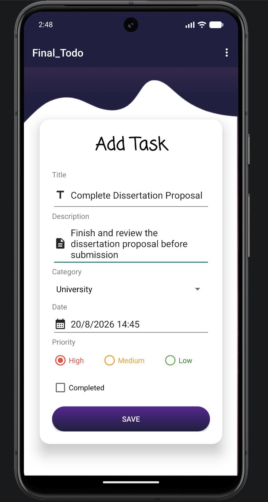
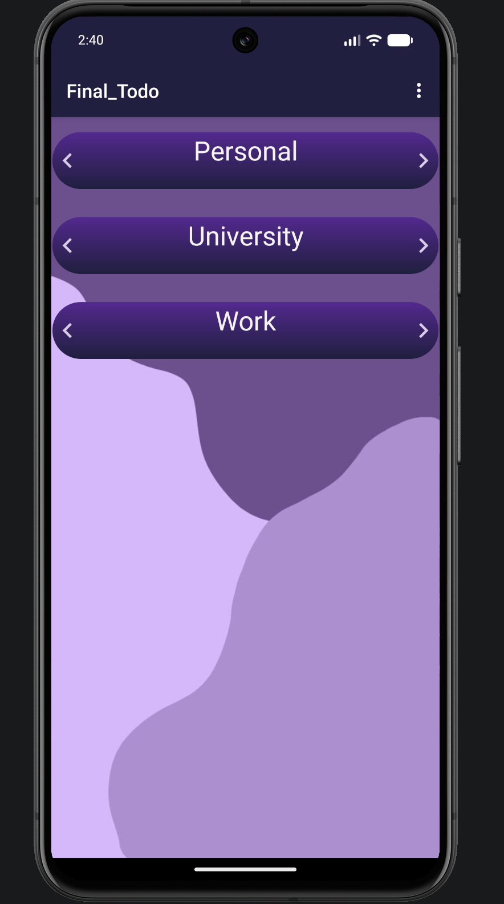
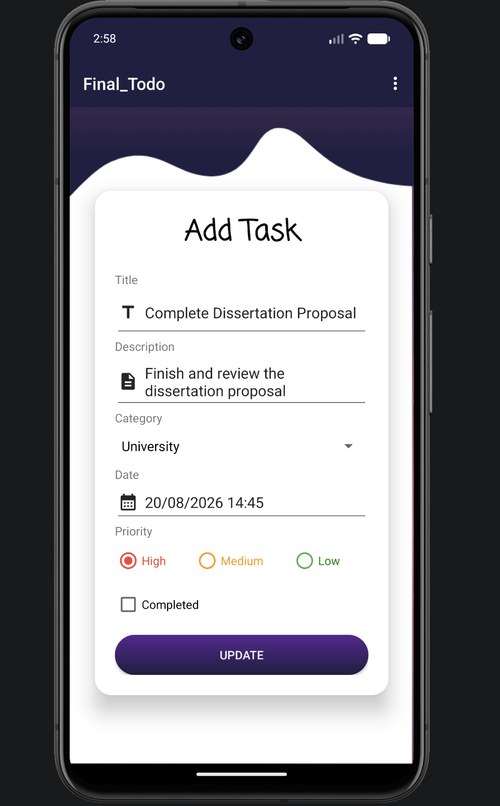
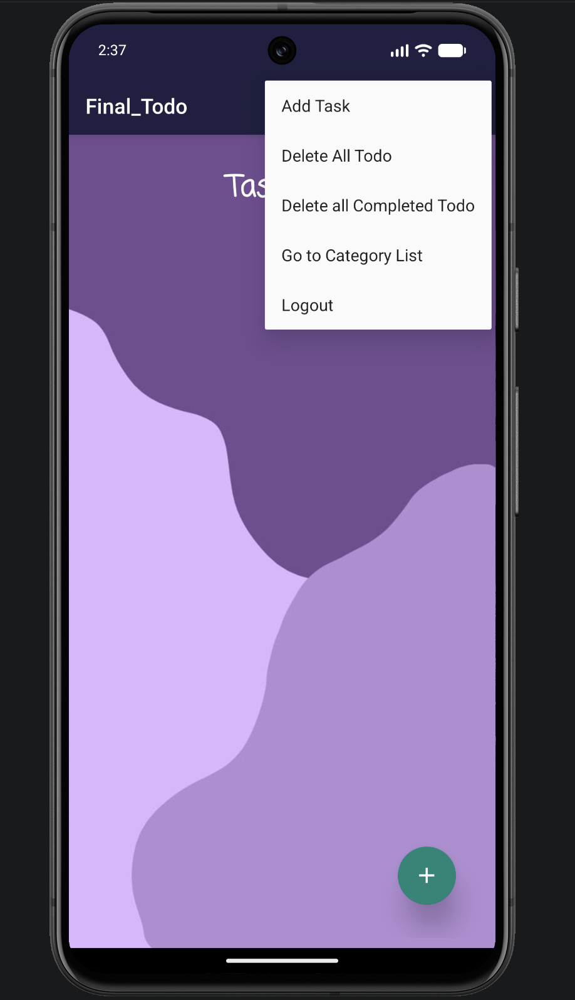

# SmartTodo Android

> A native Android task management application built with Java and Room Database, featuring local user authentication, custom categories, task priorities, deadlines, completion tracking and persistent local storage.


---

## Overview

**SmartTodo Android** is a native Android task management application developed in **Java**.

The application allows users to register and log in locally, organise tasks into custom categories, assign priorities and deadlines, track remaining time, mark tasks as completed, update existing tasks and remove individual or groups of tasks.

Rather than storing tasks only for the duration of an application session, SmartTodo uses **Room Database** for persistent local storage. The project separates database access through entities, DAOs, a repository and ViewModels, while LiveData is used to expose stored data to the user interface.

The application was originally developed as an Android project and has been preserved as a demonstration of native Android development, local persistence and structured task-management functionality.

---

## Application Interface

<p align="center">
  
</p>

The main task list provides an overview of saved tasks, their priorities, deadlines and current completion state.

---

## Features

### 🔐 Local User Authentication

SmartTodo includes user registration and login backed by the application's local Room database.

<p align="center">
  
  &nbsp;&nbsp;
  
</p>

The authentication flow includes:

- User registration
- Email and password input
- Password confirmation
- Phone number input
- Form validation
- Credential checking
- Invalid-login feedback
- Persistent login state using `SharedPreferences`
- Logout functionality

> **Note:** Authentication is implemented locally as part of the original project and is not intended to represent a production-grade authentication or security system.

---

### 📋 Task Management

Users can create tasks containing detailed information rather than only a task title.

<p align="center">
  
</p>

Each task can contain:

- Title
- Description
- Category
- Due date
- Due time
- Priority
- Completion state

Tasks are persisted locally through Room Database and displayed through a RecyclerView-based task interface.

---

### 🚦 Task Priorities

Tasks can be assigned one of three priority levels:

- 🔴 **High**
- 🟡 **Medium**
- 🟢 **Low**

Priority is visually represented in the task list, allowing important tasks to be identified quickly.

<p align="center">
  
</p>

---

### ⏱️ Deadline & Time Tracking

SmartTodo provides deadline-aware task tracking using the selected due date and time.

For active tasks, the application calculates and displays the **remaining time until the deadline**.

For example:

```text
remaining:
2d 4h 17m
```

Expired tasks can be identified when their deadline has passed.

For completed tasks, the application calculates the elapsed time between task creation and completion and displays a **completed-in** duration instead of the remaining-time countdown.

---

### 🗂️ Custom Categories

Users can create their own categories to organise tasks into meaningful groups.

<p align="center">
  
</p>

Category functionality includes:

- Creating categories
- Viewing saved categories
- Editing categories
- Deleting categories
- Clearing categories
- Associating tasks with categories
- Viewing tasks belonging to a selected category

The task-category relationship is maintained through the Room database. If a category is removed, associated tasks can remain in the database without retaining an invalid category reference.

---

### ✏️ Edit & Update Tasks

Existing tasks can be reopened and modified.

<p align="center">
  
</p>

When editing a task, its existing information is loaded back into the form, allowing the user to change its:

- Title
- Description
- Category
- Deadline
- Priority
- Completion state

The updated information is then persisted back to the local database.

---

### 👆 Swipe Actions

SmartTodo uses mobile gestures to make common task operations faster.

Task cards support swipe-based interaction:

- **Swipe right → Delete task**
- **Swipe left → Mark task as completed**

This provides a more natural mobile interaction than requiring every operation to be accessed through additional buttons or menus.

---

### 🧹 Bulk Task Operations

The task menu provides additional management functionality.

<p align="center">
  
</p>

Available operations include:

- Add Task
- Delete all tasks
- Delete all completed tasks
- Open the Category List
- Logout

This allows users to manage both individual tasks and the wider task collection.

---

## Application Architecture

The application separates the user interface from local data access through Android architecture components.

```text
┌─────────────────────────────┐
│      Activities / UI        │
│        Fragments            │
└──────────────┬──────────────┘
               │
               ▼
┌─────────────────────────────┐
│         ViewModels          │
│          LiveData           │
└──────────────┬──────────────┘
               │
               ▼
┌─────────────────────────────┐
│          Repository         │
└──────────────┬──────────────┘
               │
               ▼
┌─────────────────────────────┐
│             DAOs            │
│                             │
│ UserDao                     │
│ CategoryDao                 │
│ TodoDao                     │
└──────────────┬──────────────┘
               │
               ▼
┌─────────────────────────────┐
│        Room Database        │
│                             │
│ User • Category • Todo      │
└─────────────────────────────┘
```

The repository acts as an intermediary between the ViewModels and Room DAOs, while database write operations are handled away from the main UI thread.

---

## Local Data Model

The Room database is centred around three primary entities.

### User

Stores information required for local account registration and login.

### Category

Represents user-created organisational groups for tasks.

Examples include:

```text
Personal
University
Work
```

### Todo

Represents an individual task and stores information including:

```text
Title
Description
Due Date / Time
Priority
Category
Completion State
Creation Date
Completion Time
```

A Todo can reference a Category through the application's Room relationship.

---

## CRUD Operations

SmartTodo implements the complete task CRUD lifecycle:

| Operation | Implementation |
|---|---|
| **Create** | Add new tasks and categories |
| **Read** | Display stored tasks and categories |
| **Update** | Edit existing task/category information |
| **Delete** | Delete individual tasks/categories and perform bulk deletion |

This functionality is implemented through dedicated Room DAO operations and exposed to the application through the repository and ViewModel layers.

---

## Technology Stack

| Technology | Purpose |
|---|---|
| **Java** | Primary application language |
| **Android SDK** | Native Android application development |
| **Room 2.5.1** | Local relational persistence |
| **SQLite** | Underlying local database |
| **AndroidX** | Android support libraries |
| **ViewModel** | UI-related data management |
| **LiveData** | Observable application data |
| **RecyclerView** | Dynamic task/category lists |
| **Material Components** | Android interface components |
| **ConstraintLayout** | Responsive Android layouts |
| **SharedPreferences** | Local login/session state |
| **Gradle** | Build and dependency management |
| **Glide** | Image/resource handling |
| **android-gif-drawable** | GIF support |

---

## Android Configuration

The original project configuration uses:

```text
compileSdk: 33
targetSdk: 33
minSdk: 24
Java compatibility: Java 8
Room: 2.5.1
```

The application has also been successfully run on a modern Android emulator while preserving the original project implementation.

---

## Project Structure

```text
app/
└── src/
    └── main/
        ├── java/
        │   └── ...
        │       ├── Activities / Fragments
        │       ├── Adapters
        │       ├── ViewModels
        │       ├── Repository
        │       ├── DAOs
        │       └── Room Entities
        │
        ├── res/
        │   ├── drawable/
        │   ├── layout/
        │   ├── mipmap/
        │   └── values/
        │
        └── AndroidManifest.xml
```

---

## Running the Project

### Requirements

- Android Studio
- Android SDK
- Compatible JDK
- Android emulator or physical Android device

### Setup

1. Clone the repository:

```bash
git clone https://github.com/Avis-shek/SmartTodo-Android.git
```

2. Open **Android Studio**.

3. Select **Open** and choose the project root directory.

4. Allow Gradle to sync and download the required dependencies.

5. Select an Android emulator or connected physical device.

6. Run the `app` configuration.

The original application targets **Android API 33**, with a minimum supported API level of **24**.

---

## What This Project Demonstrates

SmartTodo demonstrates practical experience with:

- Native Android development using Java
- Android application lifecycle and navigation
- Room Database
- Relational local data modelling
- Entity relationships
- DAO-based database operations
- Repository-based data access
- ViewModels and LiveData
- RecyclerView interfaces
- CRUD functionality
- Form validation
- Local authentication
- SharedPreferences
- Category-based data organisation
- Date and time handling
- Dynamic countdown calculations
- Priority-based task management
- Gesture-based mobile interactions
- Persistent application state

---

## Potential Improvements

If rebuilding SmartTodo today, I would consider:

- Migrating the interface to **Jetpack Compose**
- Using Kotlin for modern Android development
- Implementing secure password hashing or external authentication
- Adding cloud synchronisation
- Adding push notifications and deadline reminders
- Introducing recurring tasks
- Adding task search, sorting and advanced filtering
- Adding dark mode
- Expanding automated unit and UI testing
- Migrating remaining asynchronous database operations to modern coroutine-based patterns
- Introducing dependency injection for improved maintainability and testability

---

## Status

**Completed Android application — maintained as a portfolio project demonstrating native Android development, Room persistence and structured task management.**
